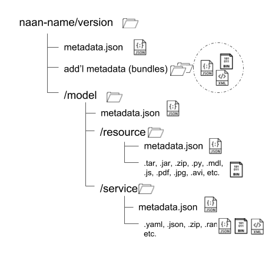

# Getting Started Developing Knowledge Objects

The Knowledge Grid consists of Libraries, Activators, and collections of Knowledge Objects. Knowledge Object (or KOs) are wrappers around a bit of code that implements some piece of computable biomedical knowledge.

This guide starts from simple KO examples and shows how to extend, build, test, and deploy them. We will install an Activator for deploying and running KOs, download example KOs and add them to the Activator's "shelf", make changes, and see the results in the running Activator. We will also talk about how to save our new versions of a KO to a Kgrid Library. 
                                                                                             

# Quick Start

Download and install an [Activator](http://kgrid.org/kgrid-activator/). The Activator is a framwork for "activator" and exposing the code in a KO as a simple RESTful API. 

The Activator getting started guide includes testing deploying using a "hello world" KO. 

# Introduction to Knowledge Objects

Knowledge Objects themselves are a simple collection of files and metadata. The core elements are **KO-level metadata**, **model metadata**, a **service description**, and **the code** itself. For the simple file system shelf we will be using with the Activator everything is in files and folders, the metadata is in JSON format, the Service Description is a YAML formatted file, and the code is in a Javascript file. 

Each version of a KO is uniquely identified by it's Ark Id (naan-name) and it's version number. So, in our file system layout we will start from `name-name/version` (in our **hello-world** example: inside `../shelf` we find `hello-world/v0.0.1`)



Change directories from the command line to the `hello-world` folder and open it up in a coding editor (the *Atom* editor from GitHub is great!)

```bash
cd path/to/shelf/hello-world
atom .
```

Navigate to the `v0.0.1` directory and open up the `metadata.json` file. It'll look something like this:

```json
{
    "title":"Hello, World",
    "description":"Simple KGrid KO development project that can be a great starting point for KO development",
    "arkId":"ark:/hello/world",
    "citations":["https://en.wikipedia.org/wiki/%22Hello,_World!%22_program"],
    "lastModified" : 1534254073624,
    "createdOn" : 1529947373860,
    "owners":"KGRID",
    "version":"v0.0.1",
    "model": "model",
    "service":"model/service/servicedescriptor.yaml"
}
```

The `"model": "model"` element points to the folder containing the codefile(s), and the ` "service":"model/service/servicedescriptor.yaml"` points the the service description file.

In the `/model` folder there is an additional `metadata.json` file containing details for the Activator on how to deploy and activate the code as REST endpoints (specified in the `servicedescriptor.yaml` file in the `service` directory.):

```json
{
  "functionName":"welcome",
  "adapterType":"JAVASCRIPT",
  "resource":"resource/welcome.js",
  "adapters":[
    {"name":"JavaScript","version":"0.0.1","filename":"javascript-adapter-0.0.1-SNAPSHOT.jar","download_url":"https://github.com/kgrid/ko-templates/releases/download/0.1/", "target":"adapters/"}
  ]
}
```

These four files are the core of the Knowledge Object. Together they allow the Activator to create a REST endpoint that can accept and process messages using the code that implements a particualr model of computable biomedical knowledge.

> You don't have to organize your code and service description in folders like `../model/service` or `../model/resource`. Within the `/model` folder you can organize however you want, as long as the metadata paths for `"service": ` and `"resource: ` point to the right files.

### The standard KO result 

...

### Using the Swagger UI test platforms

You can use `https://petstore.swagger.io` or `https://editor.swagger.io` to test the objects running in your local Activator, which is super useful when you're updating and changing the implementation.

try pasting this into your browser:

```http request
https://editor.swagger.io/?url=http://localhost:8080/hello/world/v0.0.1/service
```

# Next Steps

## Change "Hello, world!" to "Goodbye, world!"

## Developing _real_ Knowledge Objects

In a real world scenario you would be keeping your KO source code (metadata, service descriptions, etc.) in a source control system like GitHub, you'd be locking versions when they are deposited in a Library, you'd testing and committing changes over time and deciding when to release a newer version to the Knowledge Grid.

# More things to try

## Change the service description

### Use a different endpoint name

...

### Change the input and output schema

## Change the metadata for your object

